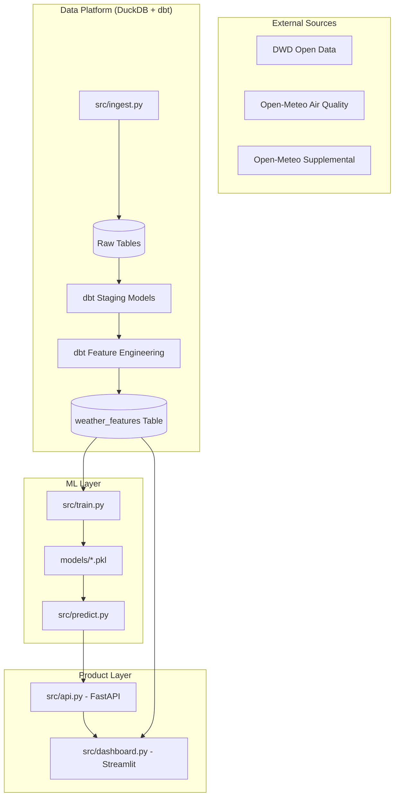
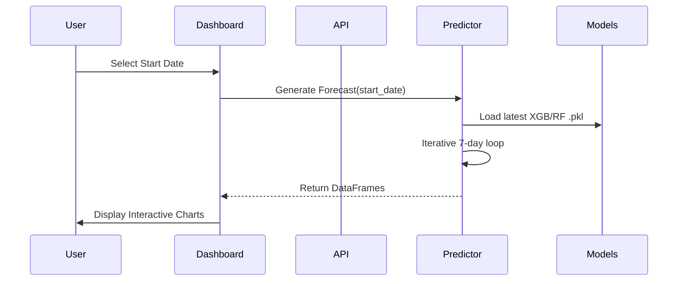

# Architectural Design: Weather Prediction System

This document outlines the end-to-end architecture of the weather prediction pipeline, from data ingestion to user interaction.

## 1. System Overview
The system is built on a "Medallion Architecture" adapted for ML:
1. **Bronze (Raw)**: Ingestion of disparate sources into DuckDB.
2. **Silver (Staging)**: dbt models for cleaning and schema normalization.
3. **Gold (Features)**: Feature engineering, lags, and rolling windows for ML consumption.
4. **Serving**: API and Dashboard for output.

---

## 2. Component Deep Dive

### A. Data Ingestion & Merging
The `WeatherIngestor` handles three distinct flows:
*   **Historical Archive**: Pulls ZIP files from DWD covering decades.
*   **Recent Update**: Bridges the gap between the archive (usually ends ~6 months ago) and yesterday.
*   **Environmental Enrichment**: Pollutants and supplemental data from Open-Meteo provide context (e.g., higher UV index usually correlates with higher max temp).

### B. Machine Learning Pipeline
We use a **Recursive Multi-Target Forecasting** approach.
1. **Targets**: The model is trained on 12+ targets (Temperature, Wind, etc.).
2. **Recursive Logic**: To predict Day 2, the model uses the *predicted* values of Day 1 as features.
3. **Incremental Training**: `train.py` detects if the feature set has changed. If so, it resets; otherwise, it performs a "warm start" to save time.

### C. The Product Bridge (API & UI)
The API acts as the "Source of Truth" for predictions, while the Dashboard provides human-readable context.

---

## 3. Data Flow Strategy
*   **Lags**: We use 1-day and 7-day lags to capture immediate trends and weekly patterns.
*   **Seasonality**: We transform `day_of_year` into `sine` and `cosine` components to represent the cyclical nature of seasons mathematically.
*   **Averaging**: 7-day rolling windows smooth out daily volatility, helping models distinguish between "noise" (a random stormy day) and "signal" (a cold front).
