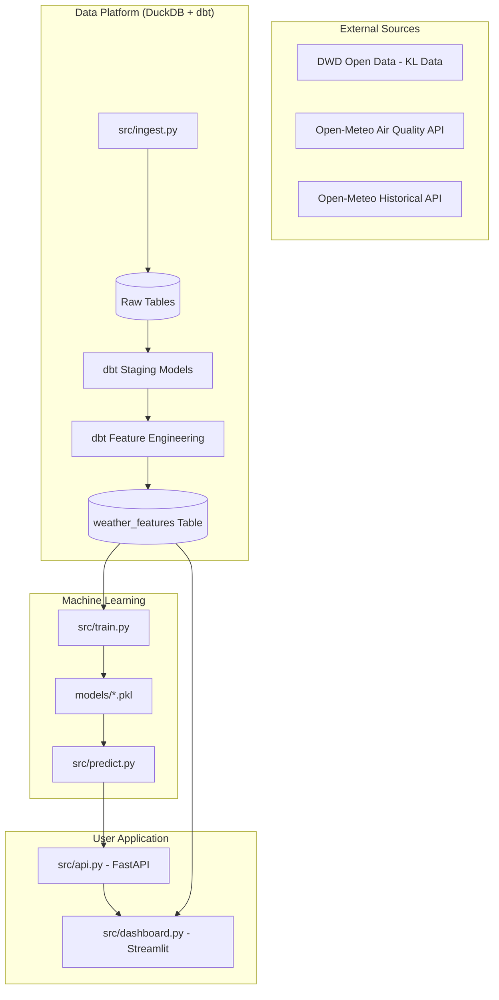

# Architectural Design

This document outlines the end-to-end architecture of the weather prediction system, designed to handle multi-station weather forecasting using automated data pipelines and machine learning.

## 1. System Overview

The system follows the **Medallion Architecture**, organizing data into layers of increasing value and refinement:

*   **Bronze (Raw)**: Raw files from DWD and Open-Meteo are ingested into DuckDB.
*   **Silver (Staging)**: dbt models clean, rename, and normalize station data.
*   **Gold (Features)**: Advanced feature engineering (lags, rolling averages, seasonality) prepares data for ML.
*   **Serving**: Results are accessible via a FastAPI backend and a Streamlit frontend.

### Architecture Diagram

## 2. Core Principles

### Multi-Station Isolation
The system treats each city (Dusseldorf, Berlin, Hamburg) as a separate entity. All data transformations and model training are partitioned by `station_id`. This prevents weather patterns in one region from incorrectly influencing predictions in another.

### Recursive Forecasting
Since weather is a time-series problem, we use recursive prediction. The model predicts tomorrow based on today, then "day-after-tomorrow" based on its own prediction for tomorrow. See [Training and Prediction](training_and_prediction.md) for details.

### Continuous Improvement (Warm Starts)
Models are not retrained from scratch if the data structure remains stable. Instead, the system "boosts" existing models with new data, ensuring that the system gets smarter over time without wasting computational resources.

## 3. Technology Stack

*   **Database**: [DuckDB](https://duckdb.org/) - A fast, in-process analytical database.
*   **Transformation**: [dbt](https://getdbt.com/) - Handles SQL-based data modeling and feature engineering.
*   **Language**: Python 3.13+ - Core logic and ML.
*   **ML Frameworks**: [XGBoost](https://xgboost.readthedocs.io/) and [Scikit-Learn](https://scikit-learn.org/) (Random Forest).
*   **Web Frameworks**: [FastAPI](https://fastapi.tiangolo.com/) (Backend) and [Streamlit](https://streamlit.io/) (Visual Dashboard).

## 4. Documentation Map
*   [**Data Ingestion**](ingestion.md): How we fetch and clean raw data.
*   [**Training & Prediction**](training_and_prediction.md): How we build features and generate 7-day forecasts.
